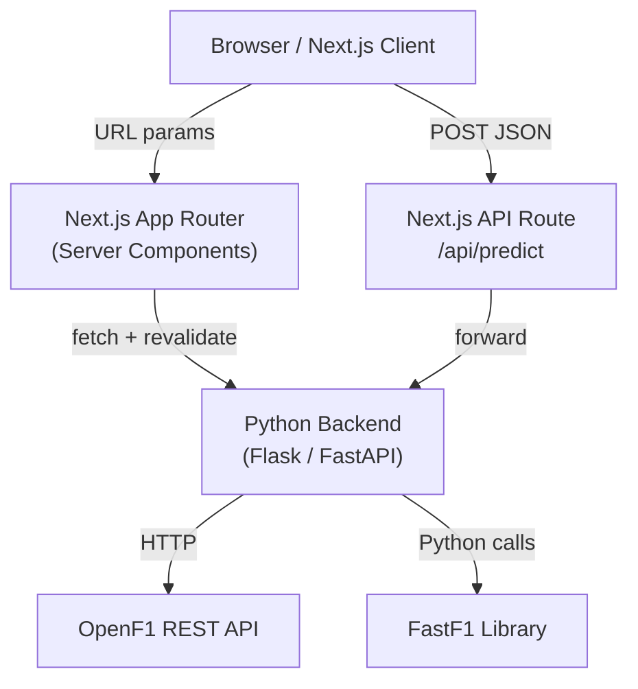

<h1 align="center">F1 Grand Prix Hub</h1>

<p align="center"><em>Real-time Formula 1 session data explorer and race outcome predictor, powered by OpenF1 and FastF1</em></p>

<p align="center">
  
  
  
  
</p>

---

## Overview

F1 Grand Prix Hub is a Next.js 15 web application that lets you explore Formula 1 race data across seasons from 2017 onwards. Select any year, meeting, and session to drill into driver standings, raw session results, per-lap telemetry, positional X/Y/Z tracking, and a ML-backed race outcome prediction panel.

Data is fetched from two sources:

- **[OpenF1 API](https://openf1.org/)** — meetings, sessions, drivers, session results, and lap data (via a Python backend proxy)
- **[FastF1](https://github.com/theOehrly/FastF1)** — positional telemetry data (X/Y/Z coordinates over time), also via the Python backend

The frontend is built with Next.js App Router (Server Components + a single `'use client'` prediction form), shadcn/ui Radix primitives, and Tailwind CSS v4.

---

## Features

- **Season browser** — select any year (2017–present), meeting/Grand Prix, and session type (Practice, Qualifying, Race, Sprint)
- **Driver standings** — session-level finishing order with lap counts, times, and gap to leader
- **Session results (raw)** — unprocessed OpenF1 data including DNF/DSQ flags
- **Drivers overview** — card grid with headshots, team colors, and car numbers pulled from OpenF1
- **Lap data** — per-driver lap-by-lap breakdown: lap time, three sector times, and speed trap
- **Position tracking** — 3D X/Y/Z positional trace for a selected driver from FastF1 telemetry
- **Race prediction** — experimental ML prediction panel that proxies feature vectors to a Python backend model and displays predicted finishing order

---

## Architecture



The Next.js frontend never calls OpenF1 or FastF1 directly. All data flows through a Python backend (configured via `NEXT_PUBLIC_BACKEND_API_URL`). The prediction endpoint is additionally proxied through `/api/predict` to keep the Python model URL server-side.

---

## Quick Start

### Prerequisites

- Node.js 20+
- A running Python backend that proxies OpenF1 and FastF1 (set `NEXT_PUBLIC_BACKEND_API_URL`)

### Install and run

```bash
git clone https://github.com/Gustav-Proxi/f1-tracker.git
cd f1-tracker
npm install
```

Create a `.env.local`:

```env
NEXT_PUBLIC_BACKEND_API_URL=http://localhost:5000/api
PYTHON_PREDICTION_API_URL=http://localhost:5000/predict_race_outcome
```

```bash
npm run dev
```

Open [http://localhost:3000](http://localhost:3000).

### Build for production

```bash
npm run build
npm start
```

---

## Project Structure

```
f1-tracker/
├── app/
│   ├── api/predict/route.ts      # Next.js API route — proxies ML predictions to Python backend
│   ├── components/
│   │   ├── DriverCard.tsx        # Driver headshot + team color card
│   │   ├── PredictionForm.tsx    # Client component — race prediction UI
│   │   └── SessionResultTable.tsx
│   ├── globals.css
│   ├── layout.tsx
│   └── page.tsx                  # Main server component — data fetching + tabbed UI
├── components/ui/                # shadcn/ui primitives (Button, Select, Tabs, Input, Label)
├── lib/
│   ├── backendApi.ts             # Typed fetch helpers for all Python backend endpoints
│   ├── ml/
│   │   ├── model.ts              # ML model interface
│   │   └── utils.ts
│   └── utils.ts
├── public/
├── next.config.ts
└── package.json
```

---

## Backend API Contract

The frontend expects the following routes on the Python backend:

| Route | Description |
|---|---|
| `GET /api/openf1/meetings/:year` | List all meetings for a season |
| `GET /api/openf1/sessions/:meetingKey` | Sessions within a meeting |
| `GET /api/openf1/drivers/:sessionKey` | Drivers in a session |
| `GET /api/openf1/session_results/:sessionKey` | Session result records |
| `GET /api/openf1/laps/:sessionKey/:driverNumber` | Per-driver lap telemetry |
| `GET /api/fastf1/position/:year/:event/:session/:driver` | 3D positional trace |
| `POST /predict_race_outcome` | Race outcome predictions (ML model) |

---

## Roadmap

- Constructor standings aggregation from session results
- Interactive lap time chart (sector delta visualization)
- Season-cumulative driver and constructor points table
- Python backend reference implementation

---

## License

No license file is present in this repository.

---

<p align="center">Data provided by <a href="https://openf1.org/">OpenF1 API</a> and <a href="https://github.com/theOehrly/FastF1">FastF1</a> (unofficial)</p>
